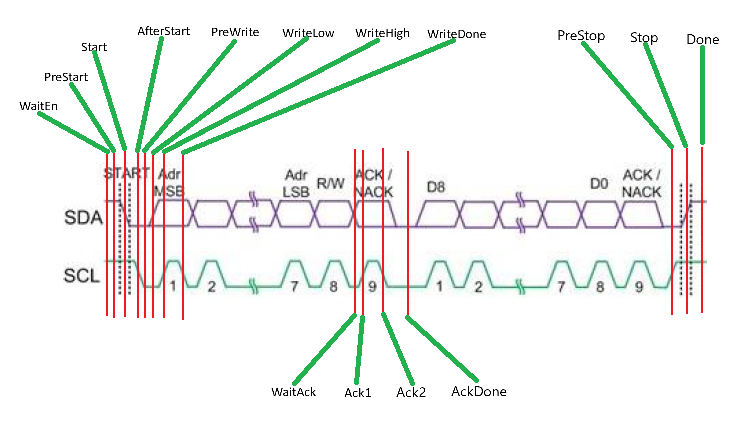
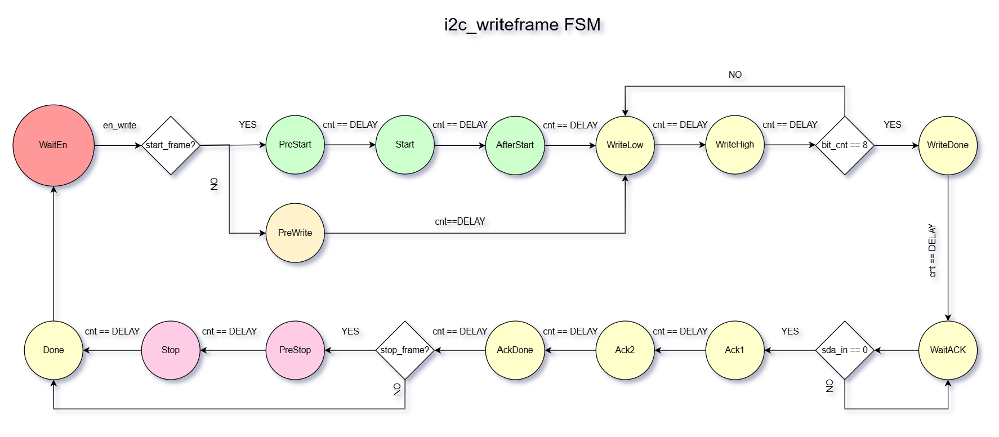
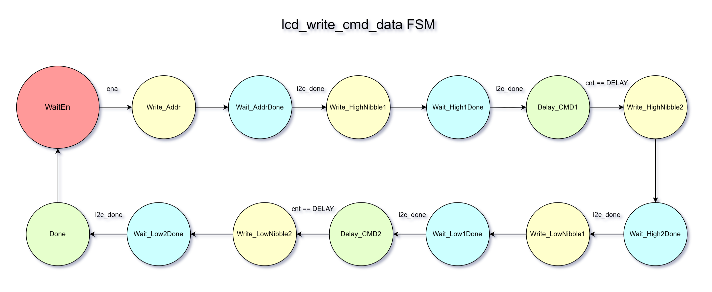
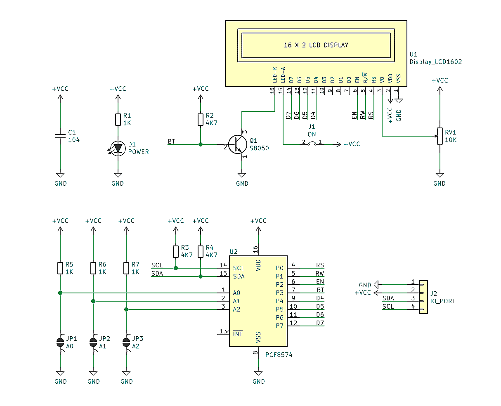

# Design report: RV32I SoC on a Tang Nano 9K FPGA

**Course:** Digital system design
**Device:** Gowin GW1NR-LV9QN88PC6/I5 (Tang Nano 9K), 27 MHz clock
**Languages:** Verilog-2001 (RTL), SystemVerilog (testbenches), C (firmware)

---

## Results at a glance

| Metric | Result |
|---|---|
| Simulation | 33 / 33 testbenches pass |
| Fmax after place and route | 31.317 MHz against a 27 MHz constraint |
| Timing violations | 0 setup, 0 hold |
| Logic utilisation | 3256 / 8640 (38%) |
| Memory | BSRAM 12 / 26; firmware 4392 bytes of an 8 KB ROM |
| Hardware | Banner reads `BOOT 5A5A5A5A 00000000`; the ST7735 shows colour bars and then the date and time read from a DS3231 |

The hardware row is from a build carrying the fixes in [fix_log.md](fix_log.md).
An earlier capture read the address as `0x21`; that reading was itself corrupted
by the register file defect, as finding 10 records.

---

## 1. Overview

This project builds a complete **system-on-chip**, not just a CPU core. At its
centre is a self-designed 32-bit RISC-V RV32I processor with a five-stage
pipeline. Around it sit instruction memory, data memory and physical
peripherals, all connected to the CPU through a **memory-mapped I/O** bus.

The result behaves like a simple microcontroller: a program written in C is
compiled to RISC-V machine code, loaded into on-chip ROM, and executed to drive
an LED, talk to a laptop over UART, read a real-time clock over I2C and drive
an ST7735 TFT over SPI.

The design is validated in three independent layers — RTL simulation,
post-synthesis timing analysis, and direct measurement on the board. Every
figure in this report is a measured result.

---

## 2. System architecture

The CPU has no instruction dedicated to peripherals. It knows only two memory
operations: `lw` to read and `sw` to write. The block that turns those two
instructions into hardware control is the **address decoder** — it watches the
top four bits of the address, routes the write strobe to the right device, and
multiplexes read data back.

```text
   ┌──────────────┐          ┌────────────────────────────────┐
   │    IMEM      │  instr   │   RV32I CPU — 5-stage pipeline  │
   │  ROM 8 KB    │ ───────► │      IF · ID · EX · MEM · WB    │
   │ firmware.hex │          └────────────────┬───────────────┘
   └──────────────┘                           │
                                              │ addr · wdata · we_mask
                                              ▼
                              ┌───────────────────────────────┐
                              │        ADDRESS DECODER        │
                              │     selects on addr[31:28]    │
                              └──┬────────┬────────┬───────┬──┘
                            0x2     0x4     0x5      0x6      0x7
                             ▼       ▼       ▼        ▼        ▼
                        ┌───────┐┌──────┐┌──────┐┌────────┐┌────────┐
                        │ DMEM  ││ GPIO ││ UART ││  I2C   ││  SPI   │
                        │RAM 4K ││      ││ 8N1  ││ 50 kHz ││ mode 0 │
                        │ stack ││      ││115200││ 1 MHz  ││6.75MHz │
                        └───────┘└──┬───┘└──┬───┘└───┬────┘└───┬────┘
                                    │       │        │         │
                                    ▼       ▼        ▼         ▼
                            ┌───────────┐┌────────┐┌────────┐┌────────┐
                            │ LED pin10 ││ TX  34 ││ SDA 31 ││ SCK 25 │
                            │           ││ RX  33 ││ SCL 32 ││ SDA 26 │
                            └───────────┘│→ laptop││→ DS3231││→ST7735│
                                         └────────┘└────────┘└────────┘
```

### Address map

Only the top four bits partition the space, which makes decoding very cheap in
logic — no 32-bit comparator is needed. Inside each peripheral the low address
bits select a register.

| `addr[31:28]` | Region | Device | Role |
|---|---|---|---|
| `0x0` | `0x00000000` | IMEM (ROM), 8 KB | Machine code for the IF stage, plus read-only data for loads |
| `0x2` | `0x20000000` | DMEM (RAM) | Globals and stack |
| `0x4` | `0x40000000` | GPIO | LED output |
| `0x5` | `0x50000000` | UART | Serial link to the laptop |
| `0x6` | `0x60000000` | I2C | 50 kHz master, read and write |
| `0x7` | `0x70000000` | SPI | ST7735 128x160 TFT, write only |

Thanks to this scheme, the C statement `*(volatile int *)0x50000000 = 'A';`
executes as an ordinary memory write, but the decoder recognises region `0x5`
and triggers the UART, pushing the character out of a physical pin as an 8N1
frame.

Region `0x0` is in the decoder as a read-only window. The ROM carries a second
read port for it, so loads reach `.rodata` and the load image of `.data`, which
is what lets the firmware use string literals and initialised globals. There is
no write enable on that region, so a store aimed at ROM is dropped rather than
faulting.

---

## 3. The CPU core and its five-stage pipeline

The CPU splits instruction execution into five consecutive stages. Between each
pair sits a **pipeline register** that holds data for exactly one clock cycle.
As a result, five different instructions are in flight at any moment.

```text
        ┌─────────────── stall: freeze PC and IF/ID for one cycle ──────┐
        │                                                              │
        ▼                                                              │
   ┌─────────┐ ║ ┌─────────┐ ║ ┌─────────┐ ║ ┌─────────┐ ║ ┌─────────┐ │
   │   IF    │ ║ │   ID    │ ║ │   EX    │ ║ │   MEM   │ ║ │   WB    │ │
   │ PC→IMEM │ ║ │ decode  │ ║ │  ALU    │ ║ │ RAM or  │ ║ │ write   │ │
   │ fetch   │ ║ │ regfile │ ║ │ compare │ ║ │ MMIO,   │ ║ │ back to │ │
   │         │ ║ │ imm_gen │ ║ │ branch  │ ║ │ byte    │ ║ │ regfile │ │
   │         │ ║ │         │ ║ │ target  │ ║ │ align   │ ║ │         │ │
   └─────────┘ ║ └─────────┘ ║ └─────────┘ ║ └─────────┘ ║ └─────────┘ │
             IF/ID        ID/EX     ▲   EX/MEM      MEM/WB             │
                                    │                                  │
                                    │        hazard_detection_unit ─────┘
                                    │
                                    ├──◄── forwarding from MEM
                                    └──◄── forwarding from WB

   ║ = pipeline register (holds data for one cycle)
```

### Implemented instruction set

38 of the 40 RV32I base instructions are implemented.

| Group | Opcode | Instructions |
|---|---|---|
| Register arithmetic | `0110011` | ADD SUB AND OR XOR SLL SRL SRA SLT SLTU |
| Immediate arithmetic | `0010011` | ADDI ANDI ORI XORI SLLI SRLI SRAI SLTI SLTIU |
| Upper immediate | `0110111` | LUI |
| PC-relative upper immediate | `0010111` | AUIPC |
| Loads | `0000011` | LB LBU LH LHU LW |
| Stores | `0100011` | SB SH SW |
| Memory ordering | `0001111` | FENCE |
| Branches | `1100011` | BEQ BNE BLT BGE BLTU BGEU |
| Calls | `1101111` | JAL |
| Returns and indirect jumps | `1100111` | JALR |

**ECALL and EBREAK are not implemented.** There is no illegal
instruction trap either, so an unimplemented opcode decodes silently to a NOP.

AUIPC needs its own control bit, `ALUSrcA`, because it is the only instruction
whose first ALU operand is its own program counter rather than a register. The
bit runs from the control unit through ID/EX to a mux in front of the ALU.

Sub-word loads and stores are handled by a dedicated **byte-alignment** circuit
in the MEM stage. On a write it replicates the data across all 32 bits and
generates a 4-bit write mask from the low two address bits; on a read it shifts
the result right and then either sign-extends or zero-fills depending on whether
the instruction is `LB` or `LBU`.

---

## 4. Three pipeline hazards

Running five instructions in parallel creates three situations a naive pipeline
would get wrong. This is the hardest part of the design and the most heavily
verified.

### A. Data hazard — solved by forwarding, zero cycles lost

```text
  cycle:             1     2     3     4     5     6
  add x1, x2, x3    IF    ID    EX   MEM    WB
  sub x4, x1, x5          IF    ID    EX   MEM    WB
                                      ▲
                                      └── taken straight from MEM, no wait for WB
```

When an instruction needs the result of the one immediately before it, that
result is still inside the pipeline and has not reached the register file. The
forwarding unit continuously compares the destination registers in MEM and WB
against the source registers EX needs; on a match it steers a multiplexer so the
ALU takes the value directly. MEM has priority over WB because its data is newer.

### B. Load-use hazard — needs a bubble, one cycle lost

```text
  cycle:             1     2     3     4     5     6     7
  lw  x1, 0(x2)     IF    ID    EX   MEM    WB
  add x3, x1, x4          IF    ID    ··     EX   MEM    WB
                                      ▲
                                      └── bubble: data only exists after MEM
```

This is the one case forwarding cannot rescue. With `lw`, the data only exists
after the MEM stage, while the next instruction needs it in EX — one cycle
earlier. The hazard detection unit recognises this from the `MemRead` signal
plus a register match, then freezes the PC and the IF/ID register for one cycle
while clearing the control bits in ID/EX to create an empty instruction.

### C. Control hazard — needs a flush, two cycles lost

```text
  cycle:             1     2     3     4     5
  beq x1, x2, dest  IF    ID    EX
                                 ▲ condition only known here
  wrongly fetched 1       IF    kill
  wrongly fetched 2             kill
  instruction at dest                  IF    ID   ...
```

The branch condition is evaluated in EX, by which time the pipeline has already
fetched two instructions along the not-taken path. When a branch is actually
taken, both IF/ID and ID/EX are cleared and the PC is steered to the target. The
cost is two cycles per taken branch; the design accepts that trade rather than
adding a branch predictor.

---

## 5. The boundary with the outside world

Everything inside the SoC runs on one 27 MHz clock. The reset input has no
relationship to it. Sampling it directly can capture a register
mid-transition, and the resulting metastable value takes an unbounded time to
settle.

Each one therefore passes through two flip-flops before anything else sees it.
The first may go metastable; the second has a full clock period to settle, which
reduces the probability of a bad value escaping to a rate measured in years.

Reset needs more than that. Asserting it asynchronously is the point of an
asynchronous reset, but **releasing** it asynchronously means the rising edge
lands wherever the contact happens to bounce. Recovery and removal timing cannot
be met, and nothing guarantees that all 1588 registers leave reset on the same
cycle. `reset_sync.v` therefore passes the release through a two-stage chain
while leaving the assertion direct:

```verilog
always @(posedge clk or negedge rst_n_in) begin
  if (!rst_n_in) chain <= {STAGES{1'b0}};
  else           chain <= {chain[STAGES-2:0], 1'b1};
end
assign rst_n_out = chain[STAGES-1];
```

The pin drives the reset of this chain and nothing else; every other module in
the design takes `rst_n_out`.

The reset input may bounce, but every low transition re-asserts reset and the
final release still passes through the synchroniser chain.

---

## 6. Peripherals

### GPIO

The simplest block in the system: a one-bit register driving the LED.

| Address | Access | Function |
|---|---|---|
| `0x40000000` | Write / Read | Bit 0 drives the LED; reads return the value written |

### UART — transmit and receive

Both directions use 8N1 framing at 115200 baud. At 27 MHz each bit lasts
`27_000_000 / 115_200 ≈ 234` cycles — that is the `CLKS_PER_BIT` parameter of
both modules.

| Address | Access | Function |
|---|---|---|
| `0x50000000` | Write | Write a byte in `data[7:0]` to start transmission, provided `tx_busy` is 0 |
| `0x50000004` | Read | Status — bit 0 `tx_busy`, bit 1 `rx_valid`, bit 2 `rx_overrun`, bits 7:3 `rx_level` |
| `0x50000008` | Read | Oldest received byte; the read pops one byte from the FIFO |
| `0x5000000c` | Write | Write one to bit 0 to clear `rx_overrun` |

The transmitter is a four-phase state machine — idle, start bit, eight data
bits, stop bit — counting a full 234 cycles per bit before advancing.

The receiver is more involved because its input arrives from the outside world,
unsynchronised to the FPGA clock. The design addresses three problems:

1. **Metastability.** The RX pin passes through two synchroniser flip-flops
   before use, avoiding metastability when a signal edge lands exactly on a
   clock transition.

2. **Mid-bit sampling.** After detecting the falling edge of the start bit, the
   receiver waits *half* a bit time and re-checks — if the line has returned
   high it was noise and the state machine goes back to idle. If it is still
   low, it was a genuine start bit, and from then on every sample lands in the
   **middle** of a bit where the signal is most stable.

   ```text
   RX  ──┐                                                    ┌──── idle
         │ start │ b0  │ b1  │ ... │ b7  │ stop               │
         └───────┴─────┴─────┴─────┴─────┴────────────────────┘
             ▲       ▲     ▲           ▲     ▲
            ½T       └─────┴─── sample mid-bit every 1T
        re-check
   ```

3. **Frame checking.** Data is shifted in LSB-first per the UART standard, and
   `rx_valid` is only raised once the stop bit is confirmed high, so a malformed
   frame is discarded rather than reported as data.

4. **A receive queue.** The receiver holds **16 bytes**. An earlier version held
   one, and a byte that arrived before software read the previous one
   overwrote it silently, which is the defect recorded as finding 17 in
   [fix_log.md](fix_log.md). The queue is a circular buffer whose read port is
   asynchronous, so a pop presents the next byte in the same cycle.

   When the queue is full a new byte is dropped rather than displacing a queued
   one, and `rx_overrun` latches. The flag is sticky and cleared by writing one
   to `0x5000000c`, so software learns that data was lost even if it was not
   watching at the moment it happened. `rx_level` reports the count, which is
   what lets a test distinguish a queue that filled from one that never
   received.

There is still no hardware flow control, so a sender that stays faster than
software will eventually overrun. See section 9.

### I2C and the real-time clock

`libs/i2c/i2c_master.v` carries one frame in either direction: an optional
START, eight data bits most significant first, one acknowledge bit, and an
optional STOP. A frame that leaves STOP off does not release the bus, which is
how several frames chain into one transaction.

| Address | Access | Function |
|---|---|---|
| `0x60000000` | Write | `data[7:0]` is the byte; `[8]` START, `[9]` STOP, `[10]` read, `[11]` refuse the byte read |
| `0x60000004` | Read | Bit 0 `busy`, bit 1 `ack` from the last write frame |
| `0x60000008` | Read | Byte received by the last read frame |

One store launches one frame, so a transaction is a sequence of stores rather
than a mode the peripheral remembers. Framing is left to software on purpose:
which register pointer to set, how many bytes follow and where a read turns
around are properties of the slave, not of the bus, and a peripheral that
encoded them would only fit one device.

The state machine runs in the **CPU's 27 MHz clock domain** and steps on a 1 MHz
tick enable from `clock_enable`. Each state is held for ten ticks, so SCL runs
at 50 kHz. An earlier version clocked it from a separately divided 1 MHz clock,
which meant a one-cycle CPU write strobe could be missed entirely. Keeping a
single clock domain removes that class of bug.

SCL and SDA are driven **open-drain**: the master either pulls the line low or
releases it to high-Z and lets the pull-up do the rest, as the I2C standard
requires.

#### Reading a register takes the bus in both directions

The DS3231 has no command that returns a register. The pointer is set with a
write, the bus is turned around with a **repeated START**, and the device then
transmits until the master refuses a byte. Reading the seven timekeeping
registers is therefore ten frames:

```text
  frame  START  dir    byte   ACK by    STOP
    1     yes   write  0xd0   slave      no     address, write
    2     no    write  0x00   slave      no     register pointer
    3     yes   write  0xd1   slave      no     repeated START, address, read
   4-9    no    read     -    master     no     six bytes, each acknowledged
   10     no    read     -    master     yes    refused, which ends the read
```

Two details decide whether this works at all.

The acknowledge bit changes owner with direction. On a write the slave drives
it and the master samples it; on a read the master drives it from `ack_out`.
A read that acknowledges every byte never ends, because the slave goes on
transmitting until it is refused.

The repeated START is not a second START on an idle bus. A chained frame
arrives with SDA held low from the previous acknowledge, so SDA has to be
released high **while SCL is still low**, and only then may SCL rise. Releasing
both together makes SDA rise while SCL is high, which is the definition of a
STOP. That was a real defect in the engine this master grew from, recorded as
finding 28 in [fix_log.md](fix_log.md); it had never been exercised because the
LCD issued a START only on its first frame.

#### The earlier design — an LCD over a port expander

The bus first carried a 20x4 HD44780 panel behind a PCF8574 port expander. That
peripheral has been removed, and the figures below describe it rather than the
current tree. They are kept because the master above grew out of the frame
engine they show, and because the STOP-condition finding they illustrate is the
same class of defect as the repeated START one.

The older design was two nested state machines. `i2c_write_frame` drove one
8-bit frame; `i2c_pcf8574_lcd_write` sat above it and turned one LCD byte into
the five frames a PCF8574 needs: the slave address, then the high nibble twice
and the low nibble twice, toggling the LCD enable line between them.

#### The frame, state by state



*Where each state of `i2c_writeframe` sits on the bus. Nine SCL pulses per
byte — eight data bits and the ACK — then `PreStop` releases SCL and `Stop`
releases SDA while SCL is high, which is the edge that defines a STOP. Driving
SDA low in `AckDone` first is what makes that edge exist; without it there is no
STOP at all, which is the defect recorded as finding 2 in [fix_log.md](fix_log.md).*



*The same machine as a state diagram. One inaccuracy to note: the transition out
of `WaitACK` is drawn as a decision on `sda_in`, but the RTL leaves that state on
the delay counter alone and samples the ACK level during `Ack1`.*

#### One LCD byte, five I2C frames



*`lcd_write_cmd_data` issues the address frame, then the high nibble twice and
the low nibble twice. The pairs exist because the HD44780 latches on the falling
edge of EN, so each nibble is sent once with EN high and once with EN low.*

The pin mapping those nibbles assume comes from the backpack itself:



*P0 to P7 carry RS, RW, EN, backlight and then DB4 to DB7, which is the byte
layout `lcd_write_cmd_data` builds. A0, A1 and A2 sit on pull-ups with the
jumpers open, so the part answers at `0x27` — the schematic is the reason the
address was never `0x21`, as finding 10 in [fix_log.md](fix_log.md) records. The
drawing shows a 16x2 display; this project drives a 20x4 through the same
backpack.*

---

### SPI and the TFT panel

`libs/spi/spi_master.v` shifts one byte in SPI mode 0: SCK idles low, MOSI
changes while SCK is low, and the slave samples on the rising edge. `CLK_DIV`
sets the half period in clock cycles and defaults to 2, so SCK runs at
27 MHz / 4 = 6.75 MHz, inside the ST7735 write cycle limit with margin for
jumper wiring.

| Address | Access | Function |
|---|---|---|
| `0x70000000` | Write | Byte to shift out; dropped while `busy` is 1 |
| `0x70000004` | Read | Bit 0 `busy` |
| `0x70000008` | Write | Bit 0 `cs_n`, bit 1 `dc`, bit 2 panel `rst_n`; reads back |

The link is **write only**. The breakout brings only SDA out to its header, so
nothing can be read back from the panel and a receive path would be logic with
nothing driving it. The consequence is that firmware cannot poll the controller
for readiness and relies on the delays the datasheet specifies.

Three signals besides the data are held in the control register rather than
sequenced by the shift engine. One ST7735 command and its parameters form a
single chip select frame with `dc` changing partway through, which the hardware
cannot infer from the byte stream; the panel reset is a plain output whose
timing belongs to the boot sequence. Out of reset the panel is **deselected and
held in reset** until firmware releases it, so it never sees traffic before it
has been configured.

The shift engine has one state that exists purely for a timing contract. After
the last bit it holds `busy` for one further half period with SCK low. Software
moves `cs_n` and `dc` as soon as `busy` clears, and without that trailing state
either line could change while SCK was still high, inside the slave's sampling
window.

#### Bringing the panel up

The initialisation sequence is deliberately limited to commands the ST7735
datasheet defines: `SWRESET`, `SLPOUT` with the 120 ms wait its section 10.1.11
requires, `COLMOD` set to `0x55` as section 10.1.29 mandates for 16-bit writes,
`MADCTL`, `INVOFF`, `NORON` and `DISPON`. The power control and frame rate
registers are left at their reset defaults, because their recommended values
come from the panel vendor rather than from the controller datasheet and
nothing so far needs them.

The first frame drawn is three vertical colour bars, not text. A bar reports
byte order, scan direction and column addressing at once, while text stays
readable when any of the three is wrong. That reasoning has one blind spot,
found later: three vertical bars look identical upside down, so they cannot
report a 180 degree rotation. Only text did, and the correction is finding 34
in [fix_log.md](fix_log.md).

#### Drawing the clock

Each glyph is written into its own address window, so a redraw touches 64
pixels rather than a whole line, and both the foreground and background colours
are written so a character replaces the one under it without a clear first. A
scale factor repeats every glyph pixel, so the time is drawn at double size
from the same font, and the two icons are eight by eight like a glyph and take
the same path.

The palette is one hue at three brightnesses over a neutral bar. An earlier
attempt used a blue bar with a light blue rule and date, which reads badly:
blue is the channel the eye is least sensitive to and the dimmest subpixel on
the panel, so small blue text on black washes out. Hours and minutes take the
brightest shade and the seconds step back one, so the eye settles on the part
that matters.

Nothing is drawn until the registers are checked. A field whose nibbles exceed
nine is not BCD, and a month or date of zero means the part has never been
given a time; either way the panel shows `NOT SET` rather than presenting a
fault as a reading.

The display is redrawn when the **seconds byte of the RTC changes**, not on a
timer. A timer cannot keep step: the loop waits its interval and then spends
further time reading I2C and printing, so it drifts against the clock and
eventually skips a second. A capture taken before the change shows exactly
that, `00:14:52` followed by `00:14:54`. Polling the part and comparing the
byte cannot drift, and a five minute capture afterwards contains 373
consecutive readings with no repeated and no skipped second.

## 7. Software and build flow

The program running on the CPU is written in C and compiled with the standard
RISC-V toolchain using `-march=rv32i -mabi=ilp32 -nostdlib -msmall-data-limit=0`.
The small-data limit is pinned to zero so nothing lands in `.sdata` or `.sbss`,
because those sections would be addressed relative to `gp` and nothing sets `gp`
up on this core.

The linker script maps `.text` and `.rodata` into ROM and `.data`/`.bss` into
RAM, giving `.data` a load address in ROM and a run address in RAM. `startup.s`
closes that gap before any C runs: it sets the stack pointer to the top of RAM,
copies `.data` across through the ROM data window, clears `.bss`, and only then
calls `main`. Every address it forms uses AUIPC.

```text
  main.c  ──gcc + linker.ld──►  firmware.elf  ──objcopy──►  firmware.bin
                                                                 │
                                                          make_hex.py
                                                                 ▼
                          IMEM  ◄──$readmemh at elaboration──  firmware.hex
```

The demo program exercises every MMIO block:

```c
/* sw/main.c - boot banner, ST7735 bring-up, clock loop */
uart_puts("BOOT ");
uart_hex32(data_marker);            /* .data  -> 5A5A5A5A */
uart_putc(' ');
uart_hex32(bss_marker);             /* .bss   -> 00000000 */
uart_puts("\r\n");

uart_puts("TFT INIT\r\n");
tft_init();                         /* SWRESET, SLPOUT, COLMOD, MADCTL, DISPON */
tft_colour_bars();                  /* three CASET/RASET/RAMWR windows */
uart_puts("TFT BARS\r\n");

while (1) {
  ds3231_read(0x00, time, 7);       /* pointer write, repeated START, 7 reads */
  if (time[0] != last_second) {     /* the seconds byte, not a timer */
    last_second = time[0];
    ds3231_print(time);             /* digits come from a .rodata table */
    tft_show_time(time);            /* glyphs from an 8x8 font in .rodata */
  }
  delay_loop(DELAY_MS(50));
}
```

The firmware uses string literals, a `.rodata` lookup table for hex digits and
globals in both `.data` and `.bss`. All three depend on the ROM data window and
on the copy and clear loops in `startup.s`.

The boot banner is deliberately a self-check rather than a greeting:

```text
BOOT 5A5A5A5A 00000000
```

`5A5A5A5A` is a `.data` global, so it reads back correctly only if `.data` was
copied out of ROM. `00000000` is a `.bss` global, so it reads back as zero only
if `.bss` was cleared. `sim/cpu/cpu_firmware_boot_tb.sv` decodes exactly these bytes off
the UART pin of the simulated SoC.

Apart from the startup code the whole program uses nothing but `volatile`
pointer assignments — no library, no operating system. That is the direct proof
that memory-mapped I/O works: software controls hardware using exactly the
instructions the CPU already has.

---

## 8. Verification

The design is confirmed in three independent layers, each catching a different
class of fault: simulation catches logic errors, timing analysis catches speed
errors, and board measurement catches physical integration errors.

### Layer 1 — RTL simulation

```bash
bash tools/run_tests.sh
```

Twenty-nine self-checking testbenches run under Icarus Verilog; all pass.

| Testbench | What it checks |
|---|---|
| `alu_tb` | All arithmetic, logic and shift operations |
| `control_unit_tb` | Opcode decoding into control signals |
| `imm_gen_tb` | Immediate generation for every instruction format |
| `core_alu_tb` | Every ALU operation, including the shift and comparison cases |
| `core_control_tb` | Control signal decode for each opcode, and FENCE as an explicit no-op |
| `core_immediate_tb` | I, S, B, U and J immediate assembly and sign extension |
| `core_regfile_tb` | Write, read, `x0` behaviour and the write-first bypass |
| `core_pc_tb` | Reset value, sequential increment and stall hold |
| `reset_sync_tb` | Asynchronous assert, synchronous release, and that the chain is not one-shot |
| `clock_enable_tb` | Tick period of the enable divider |
| `pipe_forwarding_tb` | MEM-before-WB priority |
| `pipe_hazard_tb` | Correct detection of the load-use case |
| `pipe_if_id_tb` | Reset, stall and flush behaviour |
| `pipe_id_ex_tb` | Control signal propagation and clearing on flush |
| `pipe_ex_mem_tb` | Latching of the ALU result and branch target |
| `pipe_mem_wb_tb` | Selection between memory data and ALU result |
| `cpu_address_decoder_tb` | Region select, unmapped regions, byte mask pass-through, stores into the ROM window |
| `mem_data_ram_tb` | Each byte lane, halfword masks, the 4 KB wrap, and a read concurrent with a write |
| `mem_instruction_rom_tb` | Both read ports, independently and on the same word; zero fill past the image |
| `gpio_mmio_tb` | LED register and the unmapped offsets |
| `uart_tx_tb` | A captured 8N1 frame, and a write arriving mid-frame being dropped |
| `uart_rx_tb` | Start and stop bits, LSB-first assembly, false start rejection, framing error recovery |
| `uart_mmio_tb` | Status register, RX FIFO level and overrun, TX busy flag, write-one-to-clear |
| `i2c_master_tb` | START, repeated START, both directions, the master's own NACK ending a read, and an unanswered address |
| `i2c_mmio_tb` | One store per frame, busy gating, a full turnaround read, and a store dropped mid-frame |
| `spi_master_tb` | Mode 0 idle state, MSB first order, eight sck edges per byte, the half period, a start during a transfer |
| `spi_mmio_tb` | Reset state, control persistence and readback, a data write during busy |
| `cpu_top_tb` | Full system integration (below) |
| `cpu_hazard_tb` | Load-use interlocking through the full pipeline |
| `cpu_auipc_tb` | AUIPC with the PC as the first operand |
| `cpu_uart_hex_tb` | The `sltiu` plus branch sequence used by hex formatting |
| `cpu_uart_fifo_tb` | The RX FIFO protocol driven by the CPU |
| `cpu_spi_tb` | A store reaching the SPI pins, with the state of `dc` recorded per byte |
| `cpu_fence_tb` | FENCE retiring without disturbing the pipeline |
| `cpu_firmware_boot_tb` | The real `sw/firmware.hex` image booted on the full SoC |

`cpu_top_tb` is the most important integration test: it loads a short RV32I
program exercising forwarding, load-use stalling, branch and JAL flushing,
sub-word memory access, GPIO MMIO, and a complete echo loop that drives `0xA5`
into the RX pin and checks the CPU transmits the same byte back.

### Layer 2 — Synthesis and timing analysis

Gowin EDA V1.9.12.03 completes synthesis, placement, routing, timing analysis
and bitstream generation for the GW1NR-9C against the 27 MHz constraint in
`constr/fpga_project.sdc`.

| Metric | Result | Assessment |
|---|---|---|
| Clock constraint | 27.000 MHz | Onboard oscillator |
| Actual Fmax | 31.143 MHz | 15% margin |
| Setup violated endpoints | 0 | Pass |
| Hold violated endpoints | 0 | Pass |
| Deepest logic level | 14 | Reported on the critical path to `clk` |
| Logic | 3375 / 8640 (40%) | — |
| Registers | 1599 / 6693 (24%) | — |
| Registers inferred as latch | 0 / 6480 (0%) | Every state machine has an explicit default arm |
| CLS | 2746 / 4320 (64%) | — |
| BSRAM | 6 / 26 (24%) | IMEM dual-port, plus DMEM |
| I/O ports | 8 / 71 (12%) | — |

Raw log: `logs/03-uart-rx-fifo/17-w1c-fix-build.log`.

### Layer 3 — Board measurement

The bitstream is written into the Tang Nano 9K SRAM over JTAG. The corrected
UART FIFO firmware was programmed successfully at 100%; see
`logs/03-uart-rx-fifo/18-w1c-fix-program.log`. The laptop talks to the board
through an external USB-UART module at 115200 baud, 8N1, raw, no flow control.

| Stimulus | Result | Evidence |
|---|---|---|
| Reset with no device wired | repeated `I2C NACK` | `logs/01-initial-bringup/06-fault-i2c-nack.log` |
| Reset, firmware reading `.rodata` | `I2C ` followed by two `0x00` bytes | `logs/01-initial-bringup/07-fault-rodata-null.log` |
| Reset, hex formatter using the A-F branch | `I2C 2>` instead of `I2C 27` | `logs/01-initial-bringup/08-fault-hex-branch.log` |
| Reset, fixed firmware before the source-layout refactor | `I2C 27` repeated, LCD shows `HELLO FPGA` | `logs/01-initial-bringup/05-board-uart.log` |
| UART FIFO protocol | `CASE16 PASS`, `CASE17 PASS`, `RXFIFO PASS` | `logs/03-uart-rx-fifo/19-w1c-fix-protocol.log` |

Earlier UART-only measurements with the echo firmware are recorded in
`docs/verification/rv32i_pipeline.md`, including the finding that a 1024-byte
burst loses roughly 0.3% of the stream because the receiver holds only one byte.

The LED result reads inverted with respect to the value software writes, but
that is a board convention rather than a data-path fault: the onboard LED on the
Tang Nano 9K is **active low**. Reading the GPIO register back always returns
exactly what was written.

### Process note — a bring-up lesson

During bring-up the system emitted a repeated `0x56` at roughly 2.6 Hz with the
RX pin completely idle. The symptom looked exactly like an RTL fault.

Isolation method: program two minimal test bitstreams.

1. The first wires `uart_tx_out = uart_rx_in` directly, proving the pin
   assignment and the physical link to the laptop are correct.
2. The second wires `uart_rx` straight into `uart_tx` without the CPU, proving
   the serial RTL is correct.

The real cause: the FPGA was stuck in a corrupted configuration state.
Reprogramming a **byte-identical** bitstream made the symptom vanish. The rule
adopted into the workflow: always reprogram immediately before measuring. Full
bring-up procedure in `docs/bringup.md`.

---

## 9. Limitations and future work

Defects found in review, together with the evidence for each and the fix
applied, are recorded in [fix_log.md](fix_log.md). This section lists only what
is still open.

### UART RX has no flow control

The receiver queues 16 bytes in a ring buffer and records an overrun when a
new byte arrives while the buffer is full. This absorbs short service delays,
but cannot sustain an unbounded stream faster than firmware can consume it.
Lossless sustained streaming still requires hardware flow control, a larger
buffer sized for the workload, or non-blocking software service.

### The SPI link cannot be read

The ST7735 breakout brings only SDA out to its header, so the master has no
`miso` port and nothing can be read back from the panel. Firmware cannot poll
the controller for readiness or read its identification registers, and relies
entirely on the delays the datasheet specifies. Adding the path would mean a
wire to the panel's unpopulated pad as well as RTL.

### The I2C peripheral has no stop-only operation

Every store to `0x60000000` carries eight data bits and an acknowledge, so
there is no way to emit a bare STOP. Releasing the bus after a frame that was
refused therefore costs one throwaway byte, which is harmless because a slave
that did not acknowledge is not listening to it, but it is a wart. A spare bit
in the frame register could mark a frame as stop-only.

### ECALL and EBREAK are not implemented

Two of the 40 RV32I base instructions remain. ECALL and EBREAK need a trap
vector, privilege level and CSR file to provide architectural behavior. Adding
them properly means adding machine-mode CSRs first.

### The memory read path only gets half a clock period

`mem_data_ram.v` and `mem_instruction_rom.v` read on the falling edge so the result is settled before
the rising edge that captures it into MEM/WB. That keeps the design to one
clock with no extra stall, but it gives the BSRAM output to register path
18.518 ns instead of a full 37.037 ns, and it is what limits Fmax:

```
ram/ram_3_ram_3_0_0_s/DO[7]  ->  reg_mem_wb/wb_read_data_28_s0/D
clk:[F] -> clk:[R]   slack 1.225 ns
```

At 30.210 MHz against a 27 MHz oscillator the margin is 12%, which passes with
zero violations but leaves little room. Recovering it means giving the read a
full cycle, which costs a pipeline stage or a stall on every load.

### No branch prediction

Every taken branch costs two cycles. For the current small programs this is
negligible, but it is the clearest performance improvement available.

---

## Appendix — repository layout

```text
source/   CPU RTL, peripherals and common modules. CPU files use the core_,
          pipe_, mem_ and cpu_ prefixes by responsibility.
libs/     Reusable I2C, UART and SPI RTL, each stored with its unit testbench
constr/   Pin (.cst) and timing (.sdc) constraints
sim/      Self-checking testbenches for source/, one sim/ directory per
          source/ directory. Library tests live beside their RTL in libs/
sw/       C firmware: main.c, startup.s, linker.ld, firmware.hex
tools/    Scripts for firmware, bitstream, programming and tests
docs/     Design report, register map, bring-up notes, verification results
logs/     Local verification output, ignored by Git. One folder per work
          item in the order the work happened, each folder numbering its own
          files from 01 in capture order
```
