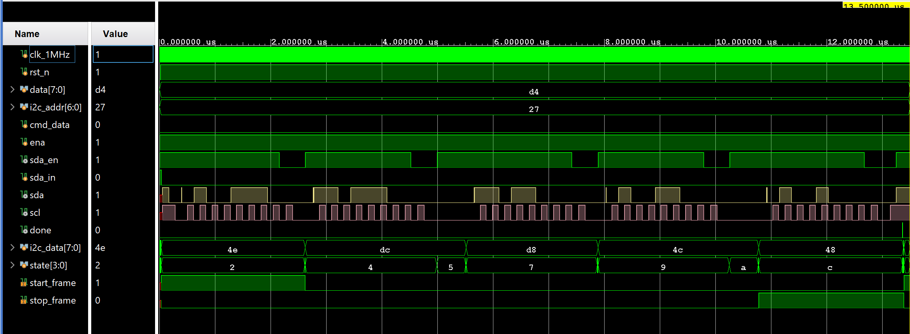

# RV32I pipeline verification

## Simulation

Icarus Verilog 12.0 passes thirty-one self-checking tests. Coverage includes ALU and decode operations,
immediate generation, register file read/write/bypass behavior, reset synchronisation, forwarding priority, load-use hazard
detection, pipeline register reset/stall/flush behavior, branch and JAL flushing, subword memory accesses,
GPIO MMIO, an UART TX frame containing `0x48`, UART RX framing with start/stop validation and LSB-first
assembly, UART RX FIFO order/full/overrun behavior, UART MMIO pop and W1C semantics, and a CPU-level echo that drives `0xA5` into the RX pin
and checks that the CPU transmits the same byte back, plus the I2C write frame FSM, the SPI shift engine, its
MMIO wrapper and a CPU-level SPI transfer. Decoder source-use flags suppress false load-use
stalls when U-type and J-type immediate fields match a preceding load destination.

Six tests are CPU-level programs rather than unit tests:

| Testbench | What it proves |
|---|---|
| `cpu_hazard_tb` | RAW dependencies at distance one through four, including a load producer, and the load-use interlock |
| `cpu_auipc_tb` | AUIPC at several program counters, loads out of the ROM window, and that a store into ROM is dropped |
| `cpu_uart_hex_tb` | The `sltiu` plus branch sequence the hex formatter depends on |
| `cpu_uart_fifo_tb` | Two UART frames queued before CPU loads, then popped in FIFO order through `0x50000008` |
| `cpu_fence_tb` | Store, FENCE, then load; confirms the fence decode and preserved memory order |
| `firmware_boot_tb` | The real `sw/firmware.hex` image booting on the full SoC, decoded off the UART pin |

`firmware_boot_tb` is the end-to-end case. It checks the banner byte by byte:

```text
firmware_boot_tb: PASS (banner "BOOT 5A5A5A5A 00000000")
```

`5A5A5A5A` is a `.data` global and `00000000` a `.bss` global, so the banner passes only if `startup.s`
copied `.data` out of ROM and cleared `.bss`. The digits come from a `.rodata` table, so it also exercises
the ROM data window.

Command:

```bash
bash tools/run_tests.sh
```

## FPGA build

Gowin V1.9.12.03 completes synthesis, placement/routing, timing analysis, and bitstream generation for
`GW1NR-LV9QN88PC6/I5` using the 27 MHz constraint in `constr/fpga_project.sdc`.

Post-route summary:

| Metric | Result |
|---|---:|
| Constraint | 27.000 MHz |
| Actual Fmax | 30.210 MHz |
| Logic levels | 12 |
| Setup violated endpoints | 0 |
| Hold violated endpoints | 0 |
| Setup TNS | 0.000 ns |
| Hold TNS | 0.000 ns |
| Logic | 3375 / 8640 (40%) |
| Registers | 1599 / 6693 (24%) |
| Registers inferred as latch | 0 / 6480 (0%) |
| CLS | 2746 / 4320 (64%) |
| BSRAM | 6 / 26 (24%) |
| I/O ports | 8 / 71 (12%) |

These figures are from the UART FIFO tree. Zero registers are inferred as latches, confirming every state
machine has an explicit default arm. Raw log: `logs/03-uart-rx-fifo/04-fpga-build.log`.

The board measurements further down are from a build carrying the fixes in [docs/fix_log.md](../fix_log.md),
except where a row is explicitly labelled as a fault capture.

The generated SRAM bitstream is `build/gowin/impl/pnr/fpga_project.fs`.

## Hardware

Gowin Programmer detects the Tang Nano 9K as `GW1NR-9C` with ID `0x1100481B`.
The UART FIFO tree was programmed into SRAM at 100% through the FT2CH JTAG
channel; see `logs/03-uart-rx-fifo/05-program-board.log`. The external USB-UART
capture in `logs/03-uart-rx-fifo/06-board-uart.log` records `BOOT 5A5A5A5A
00000000` and `I2C 27` after reset. It confirms that the FIFO bitstream boots
and preserves the existing startup/I2C path. The corrected follow-up firmware
test is built in `logs/03-uart-rx-fifo/17-w1c-fix-build.log`, programmed in
`logs/03-uart-rx-fifo/18-w1c-fix-program.log`, and reports `CASE16 PASS`,
`CASE17 PASS` and `RXFIFO PASS` in
`logs/03-uart-rx-fifo/19-w1c-fix-protocol.log`.

### UART TX

A 115200 baud, 8N1 raw capture of the transmit-only firmware contains an initial `0xff` sample followed by
repeated `0x48` bytes, confirming the UART TX path from CPU MMIO through FPGA pin 34 to the external USB-UART module.

### UART RX

The measurements below were taken with the earlier one-byte receiver. The
current receiver has a 16-byte FIFO, a sticky overrun flag and simulation
coverage for FIFO order, full handling, pop and W1C clear. The corrected board
protocol passes all FIFO cases. The historical echo firmware polls
`rx_valid`, reads `UART_BASE + 0x08`, transmits the byte back, and drives the
LED from bit 0 of the received value. Measurements use 115200 baud, 8N1, raw
mode, no flow control:

| Stimulus | Result |
|---|---|
| Idle, 5 s capture, repeated twice | 0 bytes, no spurious frames |
| Single bytes `41 42 00 ff 55 aa 0f f0 7e` | every byte echoed exactly |
| `ABHello` sent back to back | `41 42 48 65 6c 6c 6f` |
| `ABHello` sent at 20 ms spacing | `41 42 48 65 6c 6c 6f` |
| 16, 64, and 256 random bytes back to back | byte-identical echo |
| 1024 random bytes back to back | 1021 bytes returned, content mismatched |
| `A` then `B`, observing the onboard LED | LED off then on |

The LED result is inverted with respect to the firmware value. The onboard LED on the Tang Nano 9K is
active low, so driving the GPIO pin high turns it off. `A` is `0x41` and writes bit 0 as one, which switches
the LED off; `B` is `0x42` and writes bit 0 as zero, which switches it on. The GPIO register itself follows
the written value, so this is a board level polarity convention rather than a data path fault.

### Known limitation

The 16-byte FIFO prevents silent overwrite of queued bytes and records an
overrun, but it has no hardware flow control. At 115200 baud, a sustained
stream faster than the software service rate still eventually fills the FIFO.
The board protocol verifies a 16-byte burst, a 17-byte overrun burst, FIFO
ordering and W1C clear. It does not measure lossless sustained throughput;
the FIFO has no hardware flow control.

### I2C and LCD

This peripheral is no longer in the design; the observations below are the
record from when it was. The firmware that produced them has been removed, and
a DS3231 will take the bus over.

The scan firmware sweeps `0x20-0x27` and `0x38-0x3f`, reports the acknowledging address over UART and writes
`HELLO FPGA` to the display. On a build carrying the register file fix the capture repeats `I2C 27` byte for
byte and the 20x4 LCD shows the string, so `0x27` is the PCF8574 address on this backpack, matching the
datasheet default for a part with A0/A1/A2 left open.

Two earlier captures of the same board disagreed, and both are now understood as symptoms of the register
file defect rather than as address readings: `I2C 2>` is `0x27` with the low nibble mangled by the hex
formatter's branch, and `I2C 21` came from a scan whose result was corrupted before it reached the
formatter.



*One LCD byte on the bus. `i2c_addr` reads `27`, and for `data = 0xd4` as a
command the five frames are `4e`, `dc`, `d8`, `4c`, `48` — the address with the
write bit, then the high nibble with EN high and low, then the low nibble the
same way. Each matches what `i2c_pcf8574_lcd_write.v` computes. The capture
predates the move to a 1 MHz clock enable, so it shows a `clk_1MHz` input where
the current module takes `clk` and `tick`.*

| Stimulus | Result | Evidence |
|---|---|---|
| Reset with no device wired | repeated `I2C NACK` | `logs/01-initial-bringup/06-fault-i2c-nack.log` |
| Reset, firmware reading `.rodata` | `I2C ` followed by two `0x00` bytes | `logs/01-initial-bringup/07-fault-rodata-null.log` |
| Reset, hex formatter using the A-F branch | `I2C 2>` instead of `I2C 27` | `logs/01-initial-bringup/08-fault-hex-branch.log` |
| Reset, historical faulty firmware | `I2C 21` repeated, LCD shows `HELLO FPGA` | `logs/01-initial-bringup/05-board-uart.log` |

Rows two and three are CPU faults, not UART faults, and both are now fixed — see
[docs/fix_log.md](../fix_log.md) findings 6 and 1. In row three `'0' + 14` is `0x3e` and `'A' - 10 + 7` is also
`0x3e`, so the low nibble took the A-F branch while the high nibble of the same call took the correct one.
The hex formatter now uses a `.rodata` lookup table instead of that branch.

### Bring-up procedure

Recorded separately in [docs/bringup.md](../bringup.md): always reprogram before measuring, how to tell the
external USB-UART node from the FT2232 JTAG channel, restoring `ftdi_sio`, and the I2C voltage constraint.
